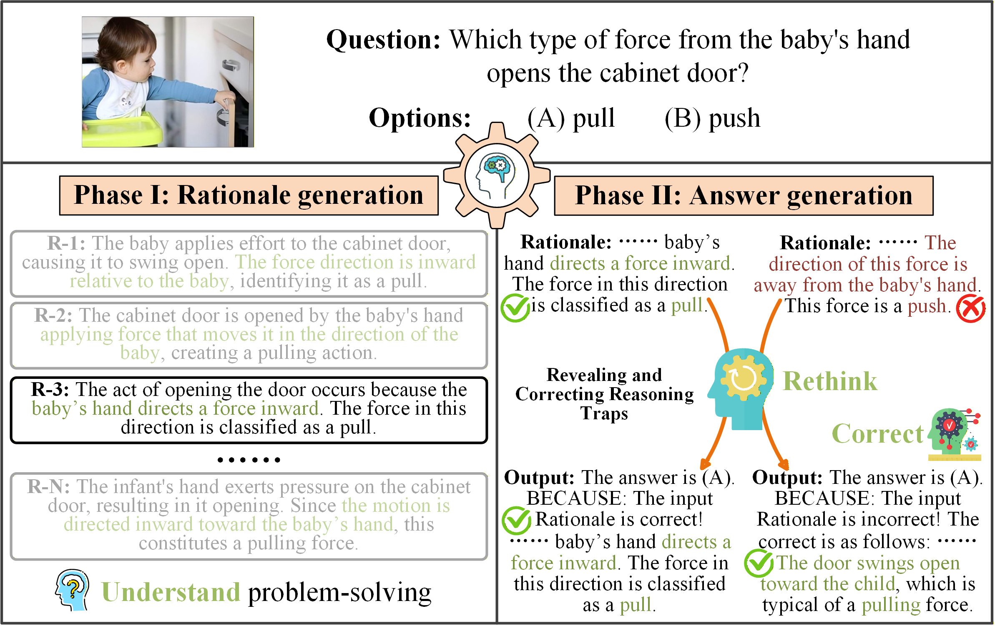

  <h1 style="border-bottom: none;">MIND: Multi-rationale INtegrated Discriminative Reasoning Framework for Multi-modal Large Models</h1>

  

    <a href="https://scholar.google.com/citations?user=Dd4_VW8AAAAJ&hl=zh-CN" target="_blank">Chuang Yu</a>1,2,
    <a href="https://scholar.google.com/citations?user=3cBa6r4AAAAJ&hl=zh-CN" target="_blank">Jinmiao Zhao</a>1,2,&nbsp
    <a>Mingxuan Zhao</a>3,&nbsp
    <a>Yunpeng Liu</a>1*,&nbsp
    <a>Xiujun Shu</a>4,
     
    <a>Yuanhao Feng</a>4,&nbsp
    <a>Bo Wang</a>4,&nbsp
    <a href="https://xyue.io/" target="_blank">Xiangyu Yue</a>5*
  

  

    1 Shenyang Institute of Automation, Chinese Academy of Sciences
      
    2 University of Chinese Academy of Sciences &nbsp;&nbsp;
      
    3 HKUST(GZ) &nbsp;&nbsp;
    4 Tencent &nbsp;&nbsp;
    5 MMLab, The Chinese University of Hong Kong
  

## ✅ Abstract
Recently, multimodal large language models (MLLMs) have been widely applied to reasoning tasks. However, they suffer from limited multi-rationale semantic modeling, insufficient logical robustness, and are susceptible to misleading interpretations in complex scenarios. Therefore, we propose a **Multi-rationale INtegrated Discriminative (MIND) reasoning framework**, which is designed to endow MLLMs with human-like cognitive abilities of **“Understand → Rethink → Correct”**, and achieves a paradigm evolution from passive imitation-based reasoning to active discriminative reasoning. Specifically, we introduce a Rationale Augmentation and Discrimination (RAD) paradigm, which automatically and efficiently expands existing datasets by generating diverse rationales, providing a unified and extensible data foundation. Meanwhile, we design a Progressive Two-stage Correction Learning (P2CL) strategy. The first phase enhances multi-rationale positive learning, while the second phase enables active logic discrimination and correction. In addition, to mitigate representation entanglement in the multi-rationale semantic space, we propose a Multi-rationale Contrastive Alignment (MCA) optimization strategy, which achieves semantic aggregation of correct reasoning and boundary separation of incorrect reasoning. Extensive experiments demonstrate that the proposed MIND reasoning framework achieves state-of-the-art (SOTA) performance on multiple public datasets covering scientific, commonsense, and mathematical scenarios. It provides a new perspective for advancing MLLMs towards higher levels of cognitive intelligence.

<!-- 

 
  
 
  <b>Understand → Rethink → Correct</b>

 -->

## 🚀 Overview

 
  
 

## ✅ TODO List
We are finalizing the release of the paper, dataset and code and aim to complete it as soon as possible. Please stay tuned! ⚡⚡⚡
- [ ] Release paper.
- [ ] Release training and inference code.
- [ ] Release ScienceQA-RAD, V-OKVQA-RAD, and M3CoT-RAD  datasets.
- [ ] Release model weights.
