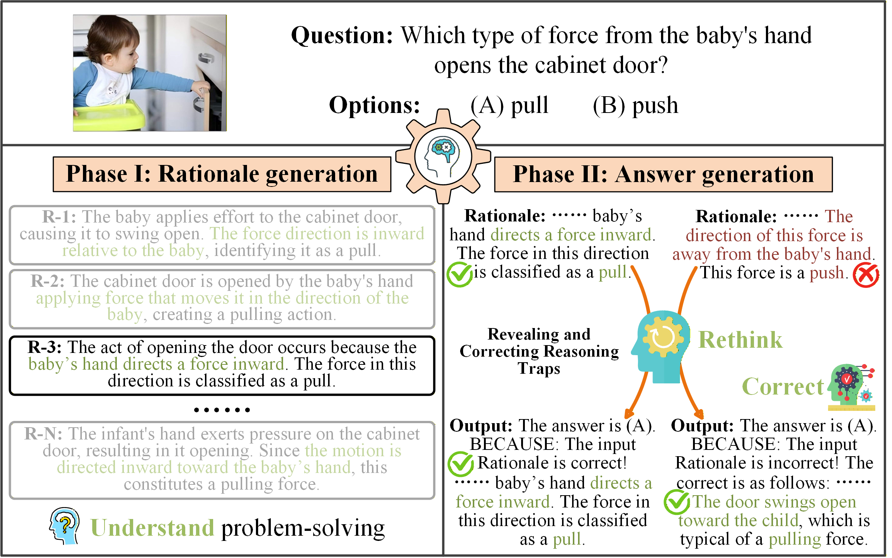
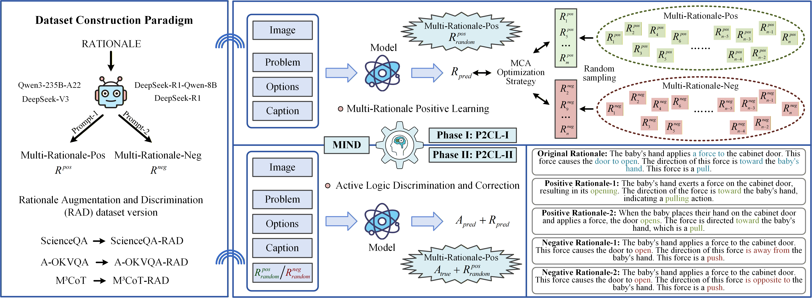

<div align="center">
  <h1 style="border-bottom: none;">MIND: Multi-rationale INtegrated Discriminative Reasoning Framework for Multi-modal Large Models</h1>
</div>

<div align="center">
  <p>
    <a href="https://yuchuang1205.github.io/" target="_blank">Chuang Yu</a><sup>1,2,5</sup>,&nbsp
    <a href="https://scholar.google.com/citations?user=3cBa6r4AAAAJ&hl=zh-CN" target="_blank">Jinmiao Zhao</a><sup>1,2</sup>,&nbsp
    <a>Mingxuan Zhao</a><sup>3</sup>,&nbsp
    <a>Yunpeng Liu</a><sup>1*</sup>,&nbsp
    <a href="https://scholar.google.com/citations?hl=zh-CN&user=H2VT_y4AAAAJ" target="_blank">Xiujun Shu</a><sup>4</sup>,
    <br>
    <a>Yuanhao Feng</a><sup>4</sup>,&nbsp
    <a>Bo Wang</a><sup>4</sup>,&nbsp
    <a href="https://scholar.google.com/citations?user=-xQ-C1sAAAAJ&hl=zh-CN" target="_blank">Xiangyu Yue</a><sup>5*</sup>
  </p>
  <p>
    <sup>1</sup> Shenyang Institute of Automation, Chinese Academy of Sciences
     <br>
    <sup>2</sup> University of Chinese Academy of Sciences &nbsp;&nbsp;
     <br>
    <sup>3</sup> HKUST(GZ) &nbsp;&nbsp;
    <sup>4</sup> Tencent &nbsp;&nbsp;
    <sup>5</sup> MMLab, The Chinese University of Hong Kong
  </p>
</div>
<p align="center">
  <a href="https://arxiv.org/abs/2512.05530"></a>
  <a href="https://yuchuang1205.github.io/"></a>
  <!-- <a href="#"></a> -->
  <!-- <a href="https://opensource.org/licenses/Apache-2.0"></a> -->
  <a href="#"></a>
  <a href="https://www.python.org/downloads/"></a>
</p>

## 🔥 News
-2026.03 🌟🌟 We have released the **complete ScienceQA-RAD, V-OKVQA-RAD, and M3CoT-RAD  datasets**.   
-2026.03 🌸🌸 We have successfully adapted MIND to **Qwen2.5-VL**, **Qwen3-VL**, and **Qwen3.5**. Preliminary experimental results show a significant improvement in performance. the extension code will be open-sourced shortly.  
-2026.03 🌟🌟 We have released the **complete code**.  
-2025.12 🌟🌟 We have released the **MIND manuscript**.  


## 💥 Abstract
Recently, multimodal large language models (MLLMs) have been widely applied to reasoning tasks. However, they suffer from limited multi-rationale semantic modeling, insufficient logical robustness, and are susceptible to misleading interpretations in complex scenarios. Therefore, we propose a **Multi-rationale INtegrated Discriminative (MIND) reasoning framework**, which is designed to endow MLLMs with human-like cognitive abilities of **“Understand → Rethink → Correct”**, and achieves **a paradigm evolution from passive imitation-based reasoning to active discriminative reasoning**. Specifically, we introduce a Rationale Augmentation and Discrimination (RAD) paradigm, which automatically and efficiently expands existing datasets by generating diverse rationales, providing a unified and extensible data foundation. Meanwhile, we design a Progressive Two-stage Correction Learning (P2CL) strategy. The first phase enhances multi-rationale positive learning, while the second phase enables active logic discrimination and correction. In addition, to mitigate representation entanglement in the multi-rationale semantic space, we propose a Multi-rationale Contrastive Alignment (MCA) optimization strategy, which achieves semantic aggregation of correct reasoning and boundary separation of incorrect reasoning. Extensive experiments demonstrate that the proposed MIND reasoning framework achieves state-of-the-art (SOTA) performance on multiple public datasets covering scientific, commonsense, and mathematical scenarios. It provides a new perspective for advancing MLLMs towards higher levels of cognitive intelligence.


<!-- <div align="center">
<br>
  
<br>
  <b><span style="font-size: 40px;">Understand → Rethink → Correct</span></b>
</div> -->

## 🚀 Overview
<div align="center">
<br>
  
<br>
</div>


## Datasets

* **ScienceQA-RAD** [[The Prepared Dataset](https://pan.quark.cn/s/91b4e26f51f6)] [[The original paper for the original dataset](https://arxiv.org/abs/2209.09513)]
* **A-OKVQA-RAD** [[The Prepared Dataset](https://pan.quark.cn/s/a47763be1d88)] [[The original paper for the original dataset](https://arxiv.org/abs/2206.01718)]
* **M3CoT-RAD** [[The Prepared Dataset](https://pan.quark.cn/s/d5199dd0e808)] [[The original paper for the original dataset](https://arxiv.org/abs/2405.16473)]  

## How to use our code

1. Download the dataset
   
&nbsp;&nbsp;&nbsp;&nbsp;&nbsp;&nbsp;&nbsp;&nbsp;Click [download datasets](https://pan.quark.cn/s/91b4e26f51f6) 

&nbsp;&nbsp;&nbsp;&nbsp;&nbsp;&nbsp;&nbsp;&nbsp;Unzip the downloaded compressed package to the root directory of the project.

2. Creat a Anaconda Virtual Environment

    ```
    conda create -n MIND python=3.10 
    conda activate MIND 
    ```
3. Configure the running environment
   
   ```
   pip install torch==2.6.0 torchvision==0.21.0 torchaudio==2.6.0 --index-url https://download.pytorch.org/whl/cu126 
   pip install openai==0.23.0 
   pip install pandas==1.4.3 
   pip install rouge==1.0.1 
   pip install sentence-transformers==2.2.2 
   pip install nltk==3.6.6 
   pip install evaluate==0.4.0 
   pip install rouge==1.0.1 
   pip install rouge_score==0.1.2 
   pip install rich>=13.3.2 
   pip install huggingface_hub==0.25.0  
   pip install transformers==4.31.0 
   pip install accelerate -U 
   pip install torchmetrics  
   pip install termcolor  
   pip install numpy==1.26.4 
   pip install ijson  
   pip install deepspeed==0.18.6  
   python -c "import nltk; nltk.download('punkt'); nltk.download('punkt_tab')"
   ```
4. Training and test the model  
    ```
    sh ./run_training.sh
    ```
5. Perform inference on each phase of the model independently. (This step is only provided for standalone inference testing purposes.)
    ```
    sh ./run_inference.sh
    ```

## ✅ TODO List
We are finalizing the release of the paper, dataset and code and aim to complete it as soon as possible. Please stay tuned! ⚡⚡⚡
- [X] Release paper.  [[Paper/arXiv](https://arxiv.org/abs/2512.05530)]
- [X] Release training and inference code.
- [X] Release ScienceQA-RAD, V-OKVQA-RAD, and M3CoT-RAD  datasets.
- [ ] Release the extension code for our MIND adaptation to **Qwen2.5-VL**, **Qwen3-VL**, and **Qwen3.5**

## Citation

If you find this repo helpful, please give us a 🤩**star**🤩. Please consider citing the **MIND** if it benefits your project. <br>  

BibTeX reference is as follows.
```
@article{yu2025mind,
  title={MIND: Multi-rationale INtegrated Discriminative Reasoning Framework for Multi-modal Large Models},
  author={Yu, Chuang and Zhao, Jinmiao and Zhao, Mingxuan and Liu, Yunpeng and Shu, Xiujun and Feng, Yuanhao and Wang, Bo and Yue, Xiangyu},
  journal={arXiv preprint arXiv:2512.05530},
  year={2025}
}
```


## Acknowledgements
Thanks to **Pan Lu**, **Dustin Schwenk**, and **Qiguang Chen** for providing the original dataset, and to **Zhuosheng Zhang** for open-sourcing Multimodal-CoT. 😊😊😊 

